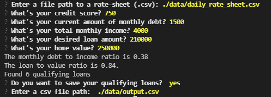

# Loan Qualifier Application

This is a python CLI (command-line interface) application which allows users to see qualifying loans from lenders quickly and easily. 

---
## Project Features
* The application uses `daily_rate_sheet` which contains loan criteria from various loan providers
* It asks any user a number of questions to evaluate their loan eligibility and returns them a list of qualifying loans.
* The application also asks the user to if the user wants to save the results as a CSV file and save the file to local disk based on the response.  

---

## Technologies

This project leverages python 3.7 with the following packages:

* [fire](https://github.com/google/python-fire) - For the command line interface, help page, and entrypoint.

* [questionary](https://github.com/tmbo/questionary) - For interactive user prompts and dialogs

* [pytest](https://docs.pytest.org/en/stable/) - For basic assertion testing of financial calculators and filters, and filio.


---

## Installation Guide

Before running the application first install the following dependencies.

```python
  pip install fire
  pip install questionary
  pip install pytest
  pip install mkdocs
```

---

## Usage

To use the loan qualifier application simply clone the repository and run the **app.py** with:

```python
python app.py
```

Upon launching the loan qualifier application you will be greeted with the following prompts.




---
## Functions used in the application with examples

* load_bank_data: This function is used to load bank data from the data rate sheet CSV file.

  Example:
  ```
  bank_data = load_bank_data()
  ```

* get_applicant_info: This function prompt dialog to get the applicant's financial information.

  Example:
  ```
  credit_score, debt, income, loan_amount, home_value = get_applicant_info()
  ```

* find_qualifying_loans: This function is used to determine which loans the user qualifies for based on Credit Score, Loan Size,Debit to Income ratio (calculated),Loan to Value ratio (calculated).

  Example:
  ```
  qualifying_loans = find_qualifying_loans(bank_data, credit_score, debt, income, loan_amount, home_value)
  ```

* save_qualifying_loans: This function saves the qualifying loans to a CSV file.

  Example:

  ```
  save_qualifying_loans(qualifying_loans)
  ```
* save_csv: This is a newly added helper function in fileio module which saves the file to specific path.
  Example:
  ```
  save_csv(qualifying_loans,csv_path)
  ```
---

## Contributors

Madhumita

---

## License

MIT
